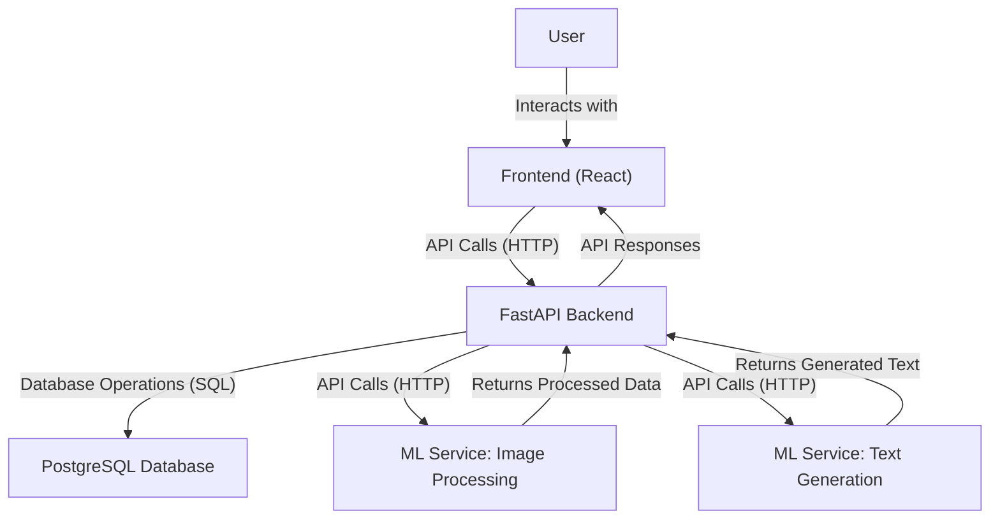
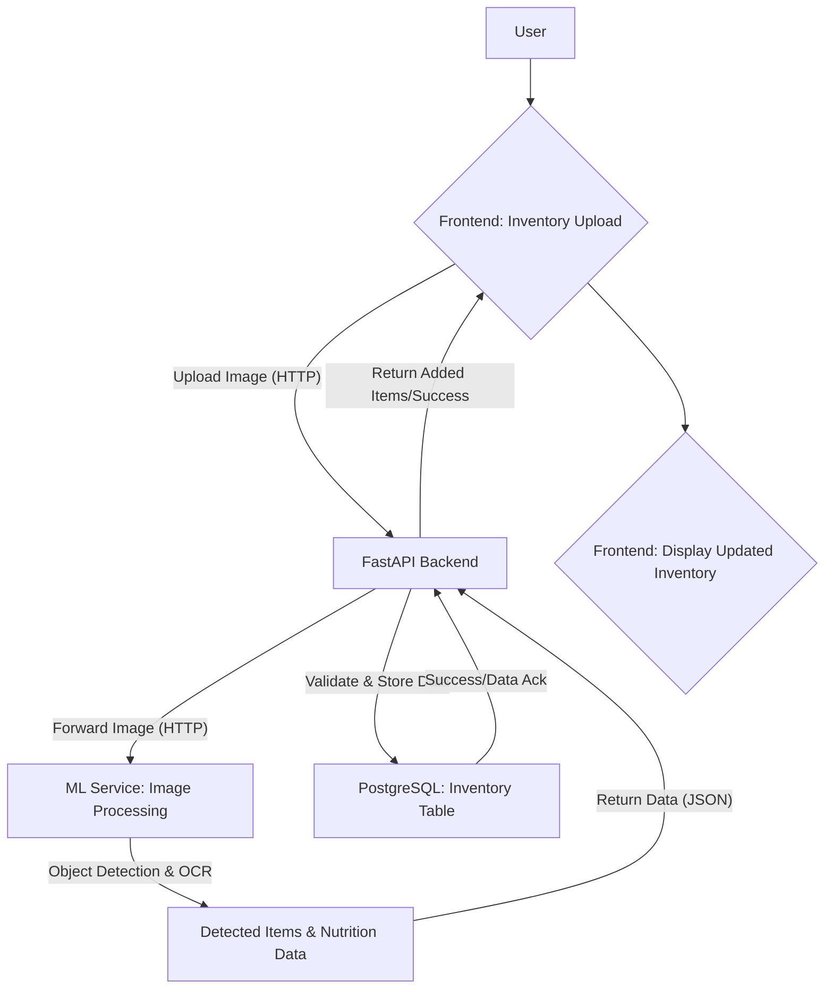
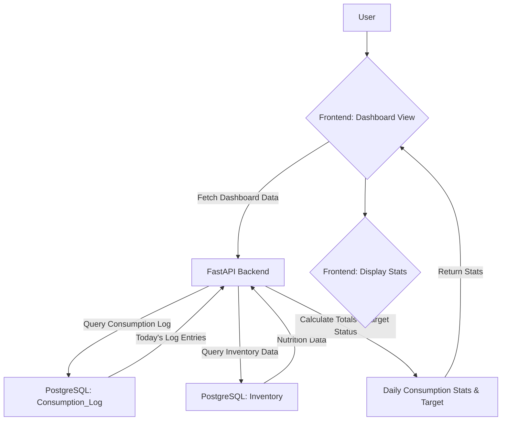
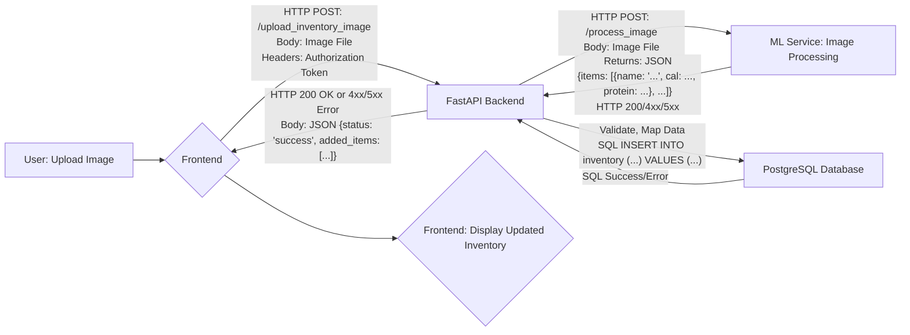
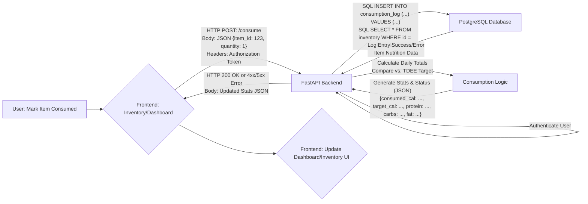

Okay, here is the system flow documentation for the NutriTrack Inventory & Fitness MVP, formatted in Markdown.

# System Flow Document: NutriTrack Inventory & Fitness MVP

## 1. Document Header

*   **Version:** 1.0
*   **Date:** May 25, 2025
*   **Application:** NutriTrack Inventory & Fitness - Core MVP Features

## 2. System Overview

The NutriTrack Inventory & Fitness application provides users with tools to track their food inventory, monitor calorie and macronutrient intake based on fitness goals, and generate simple recipes using available ingredients. The system is composed of a Frontend application, a Backend API, specialized Machine Learning (ML) services for image processing and text generation, and a PostgreSQL database for data storage.

**Key Components:**

1.  **Frontend:** User interface (React/React Native) for user interaction, data display, and input.
2.  **FastAPI Backend:** Serves as the core application logic, handling API requests, user authentication, data processing, business logic (calorie calculations), and orchestrating interactions with the Database and ML Services.
3.  **ML Services:**
    *   **Image Processing Service:** Hosts Hugging Face models (Detectron2-based for Object Detection, TroCR for OCR) to process uploaded images of food items and extract item names, quantities, and nutrition label data.
    *   **Text Generation Service:** Hosts a Hugging Face model (e.g., Flan-T5) for generating recipes based on user inventory and fitness goals.
4.  **PostgreSQL Database:** Persistent storage for user profiles, inventory items, consumption logs, and generated recipes.
5.  **Redis Cache (Optional MVP):** Can be used for caching frequently accessed data like user profiles or recent recipe prompts/results to improve performance.

**High-Level Interaction:**

The Frontend initiates requests based on user actions. These requests are routed to the FastAPI Backend, which interacts with the PostgreSQL Database for persistent data storage and retrieval. For specific tasks (image ingestion, recipe generation), the Backend communicates with the dedicated ML Services. The Backend processes data, applies business logic, and returns appropriate responses to the Frontend for display.

## 3. User Workflows

This section outlines the primary user journeys through the application's core features.

### 3.1. User Onboarding (Sign Up & Profile Setup)

1.  **User:** Accesses application.
2.  **Frontend:** Presents Sign Up form.
3.  **User:** Enters email, password, confirms password.
4.  **Frontend:** Validates client-side, sends Sign Up request to Backend.
5.  **Backend:** Validates input, hashes password, creates new user record in `users` table. Returns success response and authentication token.
6.  **Frontend:** Stores token, redirects user to Profile Setup form.
7.  **User:** Enters height, weight, age, sex, activity level, fitness goal.
8.  **Frontend:** Validates client-side, sends Profile Setup request (with token) to Backend.
9.  **Backend:** Validates input, saves profile data to the user's record in `users` table. Calculates initial BMR/TDEE and stores (or calculates on the fly later). Returns success response.
10. **Frontend:** Stores relevant user/profile data (or knows where to fetch it), redirects user to the main Dashboard or Inventory view.

### 3.2. Inventory Ingestion via Image

1.  **User:** Navigates to Inventory Upload feature.
2.  **Frontend:** Presents image upload interface.
3.  **User:** Selects and uploads a photo of pantry/fridge items.
4.  **Frontend:** Sends image file to Backend API endpoint (`/upload_inventory_image`).
5.  **Backend (FastAPI):** Receives image, authenticates user via token. Sends image file to the ML Image Processing Service API.
6.  **ML Image Processing Service:** Receives image. Runs Object Detection to find items. For each detected item, crops potential nutrition label area and runs OCR. Processes extracted text to identify calories, protein, carbs, fats per serving. Returns a list of identified items with extracted data (name, calories, macros per serving, potentially quantity/expiry if detectable) in a structured format (e.g., JSON).
7.  **Backend (FastAPI):** Receives data from ML Service. Validates and processes the data. Creates new records in the `inventory` table for each identified item, associating them with the user ID. Sets default quantity (1) if not detected. Returns success response with the list of newly added items.
8.  **Frontend:** Receives success response. Fetches and displays the updated Inventory list, including the newly added items.

### 3.3. Inventory View & Manual Edits

1.  **User:** Navigates to Inventory View.
2.  **Frontend:** Sends request (with token) to Backend (`/inventory`) to fetch user's current inventory.
3.  **Backend:** Queries `inventory` table for items belonging to the authenticated user. Returns list of items (name, nutrition, expiry, quantity) to Frontend.
4.  **Frontend:** Displays the list of inventory items.
5.  **User (Action: Add Item):** Clicks "Add Item". Frontend presents a form. User enters item details. Sends request (`POST /inventory`) to Backend. Backend validates, saves to `inventory`, returns new list. Frontend updates display.
6.  **User (Action: Edit Item):** Clicks "Edit" on an item. Frontend presents form pre-filled with item data. User modifies data. Sends request (`PUT /inventory/{item_id}`) to Backend. Backend validates, updates `inventory` record, returns updated list. Frontend updates display.
7.  **User (Action: Delete Item):** Clicks "Delete" on an item. Frontend sends request (`DELETE /inventory/{item_id}`) to Backend. Backend deletes record from `inventory`, returns updated list. Frontend updates display.
8.  **User (Action: Mark as Consumed):** Clicks "Consume" on an item (specifying quantity). Frontend sends request (`POST /consume`) to Backend. Backend updates the `consumption_log` table (user_id, timestamp, item_id, quantity, nutrition snapshot). Backend calculates updated daily calorie/macro totals for the user. Returns success and updated daily stats. Frontend updates display and dashboard stats.

### 3.4. Fitness Profile-Based Calorie Tracking

1.  **Backend/Frontend (Setup):** On profile setup, or periodically, Backend calculates user's TDEE based on profile data (BMR calculation + activity level). This is the daily calorie target.
2.  **User (Action: Consume Item):** See step 3.3. The key here is that marking an item as consumed triggers the calorie/macro tracking update.
3.  **Frontend (Dashboard View):** Sends request (`/dashboard_data`) to Backend.
4.  **Backend:** Queries `consumption_log` for today's entries for the user. Retrieves nutritional data for consumed items from `inventory`. Calculates total calories, protein, carbs, fats consumed today. Compares consumed calories to the user's TDEE target. Queries `consumption_log` for recent activity to show depletion log. Returns JSON data (consumed vs target calories, macro breakdown, depletion log).
5.  **Frontend:** Displays the dashboard with current day's consumption stats and depletion log.

### 3.5. Recipe Generator

1.  **User:** Navigates to Recipe Generator.
2.  **Frontend:** Optionally displays current inventory (from a prior fetch or fetches fresh data). Sends request (`/generate_recipe`) to Backend, including the user's current inventory item names and their fitness goal (gain/lose/maintain).
3.  **Backend (FastAPI):** Receives inventory list and goal. Formulates a prompt for the Text Generation ML Service: "Generate a healthy recipe using: [item1, item2, ...] for someone trying to [gain/lose/maintain] weight." Sends prompt to the ML Text Generation Service API.
4.  **ML Text Generation Service:** Receives prompt. Uses the Text2Text model to generate a recipe (ingredients list, simple instructions) based on the provided constraints. Returns the recipe text.
5.  **Backend (FastAPI):** Receives recipe text. Optionally stores it temporarily or permanently (e.g., in a `recipes` table with user_id, timestamp, used_items, generated_text). Returns the recipe text to the Frontend.
6.  **Frontend:** Displays the generated recipe text.

### 3.6. Reports & Alerts

1.  **User:** Navigates to Reports or Dashboard (where alerts are shown).
2.  **Frontend:** Sends request (`/reports_alerts`) to Backend.
3.  **Backend:**
    *   Queries `consumption_log` and `inventory` to calculate weekly nutrient trends and identify top contributors over a defined period.
    *   Checks daily consumed calories vs. TDEE target for alerts.
    *   Queries `inventory` to find items with expiry dates within the alert window (e.g., < 2 days).
    *   Packages trend data, contributor data, and alert messages into a JSON response.
4.  **Frontend:** Receives data. Renders charts (bar/pie) for trends, lists top contributors, and displays alert messages prominently.

### 3.7. Basic Voice & Text Q&A (MVP: Text Only)

1.  **User:** Navigates to Q&A interface, types a question (e.g., "What's in my fridge?", "How much protein today?").
2.  **Frontend:** Sends the text query (`/ask`) to the Backend.
3.  **Backend (FastAPI):**
    *   Receives text query, authenticates user.
    *   Parses the query (simple keyword matching or basic NLP).
    *   Based on parsed query, performs relevant database queries (e.g., fetch `inventory` for user, fetch `consumption_log` for user for today and calculate protein).
    *   Formats the results into a natural language response text.
    *   Returns the response text to the Frontend.
4.  **Frontend:** Displays the text response to the user.

## 4. Data Flows

This section details how data moves between components during critical operations.

### 4.1. Image Inventory Ingestion Data Flow

**Flow Description:**

1.  User initiates image upload via Frontend.
2.  Frontend sends the image file and user's auth token in an HTTP POST request to the FastAPI Backend.
3.  FastAPI Backend authenticates the user. It then forwards the image file to the ML Image Processing Service endpoint.
4.  The ML Service processes the image (detection, OCR) and returns the structured item data (JSON) back to the FastAPI Backend.
5.  FastAPI Backend validates the received data, maps it to the `inventory` table schema, and executes SQL INSERT statements to save the data to the PostgreSQL database, associated with the user's ID.
6.  PostgreSQL confirms the data insertion or returns an error.
7.  FastAPI Backend sends a success or error response back to the Frontend, potentially including the details of the items added.
8.  Frontend updates the UI to show the results, either displaying the new items or an error message.

### 4.2. Consumption Logging & Dashboard Update Data Flow

**Flow Description:**

1.  User marks an item as consumed (e.g., clicks a button on the Inventory view).
2.  Frontend sends an HTTP POST request to the FastAPI Backend's `/consume` endpoint, including the item ID, quantity, and user's auth token.
3.  FastAPI Backend authenticates the user. It inserts a new record into the `consumption_log` table for the user and timestamp. It also queries the `inventory` table to get the nutritional details of the consumed item.
4.  PostgreSQL executes the INSERT and SELECT queries and returns results/confirmation to the Backend.
5.  The Backend uses the `consumption_log` data (potentially just today's or all relevant entries) and the consumed item's nutrition data to calculate the user's total calories and macronutrients consumed for the day. It compares the consumed calories against the user's stored TDEE target.
6.  The Backend generates a JSON response containing the updated daily statistics.
7.  FastAPI Backend sends this JSON response back to the Frontend.
8.  Frontend receives the updated stats and refreshes the Dashboard or relevant UI elements to reflect the changes.

## 5. Error Handling

Robust error handling is crucial for a smooth user experience and system maintainability.

**General Strategies:**

*   **Validation:** Implement both Frontend and Backend validation for user input (e.g., numeric values for profile stats, required fields, email format). Frontend provides immediate feedback; Backend provides authoritative validation before processing or saving data.
*   **API Status Codes:** Use standard HTTP status codes (4xx for client errors - Bad Request, Unauthorized, Not Found; 5xx for server errors - Internal Server Error, Service Unavailable) in FastAPI responses.
*   **Meaningful Error Messages:** Return clear, user-friendly error messages to the Frontend (e.g., "Invalid email or password," "Could not process image, please try again," "Item not found"). Log detailed technical error messages on the Backend for debugging.
*   **Logging:** Implement comprehensive logging in the Backend (FastAPI) and ML Services to record errors, warnings, and key events. This helps diagnose issues quickly. Use a structured logging format if possible.
*   **Graceful Degradation:** If an optional component (like the ML Service) fails, the core application should ideally still function where possible (e.g., manual inventory entry still works even if image processing is down). For MVP, direct user notification is acceptable ("Image processing failed").
*   **Database Errors:** Handle potential database errors (connection issues, constraint violations, query failures) within the Backend, preventing application crashes and returning appropriate API errors.

**Specific Error Scenarios & Handling:**

*   **Authentication/Authorization:** Return 401 Unauthorized for missing/invalid tokens, 403 Forbidden if a user tries to access/modify data they don't own.
*   **Image Upload/Processing:**
    *   Invalid file type/size: Frontend validation + Backend validation, return 400.
    *   ML Service unreachable/error: Backend catches the error during the API call to the ML service, logs it, returns 500 or a specific 4xx error (e.g., 424 Failed Dependency) to the Frontend with a message like "Image processing service error."
    *   ML Service returns no items/data: Backend logs the result, returns 200 with an empty or clear message ("No food items detected in the image.") to the Frontend.
*   **Database Operations:** Backend catches exceptions during database interactions (e.g., connection errors, unique constraint failures for users, invalid IDs), logs the error, and returns 500 or 404/400 depending on the cause.
*   **Recipe Generation:** If the ML Text Generation Service returns an error or irrelevant output, the Backend should catch it, log it, and return an error message to the user ("Could not generate recipe, please try again.") or a fallback message.

## 6. Security Flows

Security focuses on protecting user data and application integrity.

**Authentication (Who are you?):**

1.  **Sign Up:** User provides email and password. Backend hashes the password before storing it in the `users` table. Email should be validated for format and uniqueness.
2.  **Login:** User provides email and password. Backend retrieves the user record by email, hashes the provided password, and compares it to the stored hash.
3.  **Token Generation:** Upon successful login, the Backend generates a secure JSON Web Token (JWT). This token contains claims (like user ID) and is signed by the server's secret key.
4.  **Token Transmission:** The JWT is sent back to the Frontend (e.g., in an HTTP header or response body).
5.  **Token Storage:** The Frontend stores the JWT securely (e.g., in `localStorage` or `sessionStorage`, depending on sensitivity and session requirements).
6.  **Authenticated Requests:** For subsequent requests requiring authentication (fetching inventory, adding items, etc.), the Frontend includes the JWT in the `Authorization: Bearer <token>` header.
7.  **Token Verification:** The Backend middleware intercepts incoming requests, extracts the JWT, verifies its signature using the secret key, and checks for expiration. If valid, the user's identity (from token claims) is available for authorization. If invalid or missing, return 401 Unauthorized.

**Authorization (What are you allowed to do?):**

1.  **Resource Ownership:** Data in `users`, `inventory`, and `consumption_log` tables is explicitly linked to a `user_id`.
2.  **Backend Enforcement:** For *every* API endpoint that accesses or modifies user-specific data (e.g., `/inventory`, `/consume`, `/users/{user_id}`, `/reports_alerts`), the Backend must:
    *   Authenticate the request using the JWT.
    *   Extract the `user_id` from the valid token.
    *   Ensure that the data being accessed or modified belongs *only* to that specific `user_id`. This involves including `WHERE user_id = <authenticated_user_id>` clauses in all database queries.
    *   If a request attempts to access/modify data belonging to a different user, return 403 Forbidden.
3.  **Frontend Awareness:** The Frontend should only *attempt* to fetch or display data relevant to the logged-in user, but the Backend is the final enforcement point.

**Data Protection:**

*   **HTTPS:** All communication between the Frontend and Backend, and between the Backend and ML Services, should use HTTPS to encrypt data in transit.
*   **Password Hashing:** Store only hashed passwords using a strong, modern hashing algorithm (like bcrypt).
*   **Input Validation:** Prevent injection attacks (SQL injection via ORM/prepared statements, cross-site scripting) by validating and sanitizing all user input on the Backend.
*   **Database Access Control:** Limit direct access to the PostgreSQL database only from the Backend service. Use dedicated database users with minimal privileges.

**API Security:**

*   **Rate Limiting (Optional MVP):** Implement rate limiting on certain endpoints (e.g., login, sign up, image upload) to mitigate brute-force and denial-of-service attacks.
*   **Environment Variables:** Store sensitive configuration (database credentials, JWT secret key, ML service API keys) in environment variables, not directly in code.
