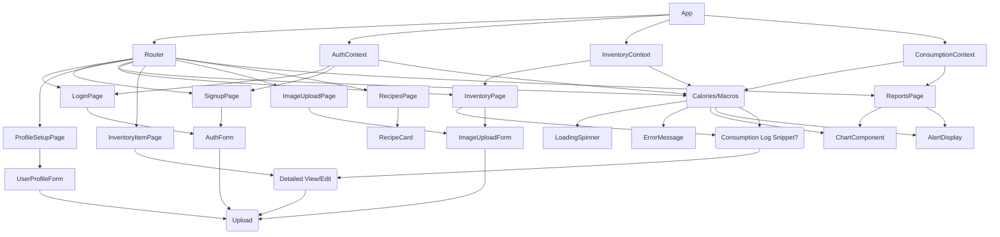

```markdown
# Frontend Implementation Guide: Fitness & Inventory Tracker MVP

**Version:** 1.0
**Date:** May 25, 2024

This document outlines the frontend implementation strategy for the Fitness & Inventory Tracker Minimum Viable Product (MVP). The guide focuses on using React for a web-based application, covering core architecture, state management, UI considerations, API integration, testing, and providing practical code examples.

## 1. Component Architecture

The application will follow a component-based architecture, breaking down the UI into reusable and manageable pieces.

**Core Structure:**

*   **`App.js`**: The root component. Sets up the context providers and routing.
*   **`Router.js`**: Handles navigation between different pages/screens using a library like `react-router-dom`.
*   **`Layout.js`**: Provides a consistent structural wrapper for main pages (e.g., including a header, navigation, and footer).
*   **Pages/Screens**: Components representing full views for different routes.
    *   `LoginPage.js`
    *   `SignupPage.js`
    *   `ProfileSetupPage.js`
    *   `DashboardPage.js`
    *   `InventoryPage.js`
    *   `InventoryItemPage.js` (for viewing/editing a single item)
    *   `ImageUploadPage.js`
    *   `RecipesPage.js`
    *   `ReportsPage.js`
*   **Reusable Components**: Smaller UI elements used across pages.
    *   `AuthForm.js` (used by Login/Signup)
    *   `UserProfileForm.js`
    *   `InventoryList.js`
    *   `InventoryItemCard.js` (displays single item info)
    *   `ImageUploadForm.js`
    *   `RecipeCard.js`
    *   `ChartComponent.js` (for reports)
    *   `AlertDisplay.js`
    *   `LoadingSpinner.js`
    *   `ErrorMessage.js`
    *   Form inputs (reusable `Input`, `Select`, etc.)
    *   Buttons (reusable `Button`)

**Relationships:**

*   `App` renders `Router` and context providers.
*   `Router` renders the appropriate Page based on the URL.
*   Pages use the `Layout` component for structure.
*   Pages are composed of Reusable Components.
*   Components receive data via props or consume state via Context/State Management.



## 2. State Management

For the MVP, a combination of React's `useState` for local component state and `useContext` for application-wide state (like user authentication, user profile, inventory list, and daily summaries) is a pragmatic starting point. This avoids external libraries initially but allows for structured state sharing. If the application complexity grows significantly, migrating to a library like Zustand or Redux Toolkit can be considered later.

**Key State Areas & Management:**

*   **Authentication & User Profile:**
    *   `AuthContext`: Stores the current authenticated user object (`{ id, email, ...profileData }`) and authentication status (`isAuthenticated`). Provides `login`, `signup`, `logout` functions that interact with the API and update the context state.
*   **Inventory:**
    *   `InventoryContext`: Stores the list of current inventory items (`Array<{ id, name, quantity, calories, expiry, ... }`). Provides functions to `fetchInventory`, `addItem`, `updateItem`, `deleteItem`, `markConsumed` (which also triggers consumption log update).
*   **Consumption Tracking:**
    *   `ConsumptionContext` (or integrated into Inventory/Dashboard context): Stores daily consumption summary (`{ totalCalories, protein, carbs, fat }`) and potentially a log of recent consumptions. Provides a function to `fetchDailySummary`.
*   **Recipes:**
    *   Managed locally within the `RecipesPage` or a dedicated `RecipeContext` if recipes need to be shared or cached globally. Stores the list of generated recipes.
*   **Reports:**
    *   Managed locally within the `ReportsPage`. Fetches and stores data for specific reports (e.g., weekly nutrient trends).
*   **UI State:**
    *   `useState` in components for form inputs, loading indicators (`isLoading`), error messages (`error`), modal visibility, etc.

**Example Flow (Marking Item as Consumed):**

1.  User clicks "Consume" button on an `InventoryItemCard`.
2.  `InventoryItemCard` calls a `markConsumed(itemId, quantity)` function provided by `InventoryContext`.
3.  `markConsumed` function:
    *   Updates local state immediately (optimistic update) or shows a loading state.
    *   Makes an API call (`POST /consumption`) to log the consumption and potentially update the backend inventory quantity.
    *   If successful, updates the inventory list state (removing or reducing quantity of the item).
    *   Triggers a refresh or update of the daily consumption summary (e.g., calling `fetchDailySummary` from `ConsumptionContext`).
    *   If an error occurs, rolls back the optimistic update and displays an error message.

## 3. UI Design

The UI should be clean, intuitive, and functional, prioritizing the core user flows:

*   **Authentication:** Simple forms for email/password login and signup. Clear validation messages.
*   **Profile Setup:** A straightforward form with fields for height, weight, age, sex, activity level, and fitness goal. Radio buttons or dropdowns for sex, activity level, and goal.
*   **Dashboard:** A clear overview.
    *   Prominent display of Calories Consumed vs. Target. Use a progress bar or circular chart.
    *   Simple breakdown of Protein, Carbs, and Fat (e.g., using text or a pie chart).
    *   A recent Inventory Depletion Log (maybe a small list).
    *   Quick links or buttons to Inventory, Upload, Recipes, Reports.
*   **Inventory View:**
    *   A list or grid of items. Each item card shows name, maybe quantity, and key nutrition info (calories per serving).
    *   Clear "Add Item" button.
    *   Buttons or icons on each item card for "Edit", "Delete", and "Consume".
    *   Search/Filter functionality can be added later if needed.
*   **Inventory Item Edit/Add:** A form pre-filled with existing data for edits, or empty for new items. Fields for name, quantity, calories/serving, expiry date (date picker).
*   **Image Upload:** A clear drag-and-drop area or button to select an image file. Display a loading state while processing. Show results (detected items) for confirmation or editing before saving to inventory.
*   **Recipe Generator:**
    *   Potentially show the list of ingredients being used based on current inventory.
    *   Display generated recipes clearly (Recipe Name, Ingredients List, Instructions). Simple text format is fine for MVP.
*   **Reports & Alerts:**
    *   Dedicated page or section.
    *   Charts (e.g., using a library like Chart.js or Nivo) for weekly nutrient trends.
    *   A list for "Top Contributors".
    *   A dedicated section or dismissible notifications for alerts (Expiry warnings, Calorie goal warnings).
*   **General:**
    *   Consistent header/navigation.
    *   Loading states and error messages should be clearly visible.
    *   Responsive design is recommended if targeting both desktop and mobile browsers.

## 4. API Integration

The frontend will communicate with the FastAPI backend using RESTful API calls.

*   **HTTP Client:** Use the browser's native `fetch` API or a library like `axios`. `axios` provides features like interceptors and automatic JSON transformation which can be helpful.
*   **Base URL:** Configure a base URL for the backend API (e.g., `http://localhost:8000/api/v1`).
*   **Authentication:**
    *   Upon successful login/signup, the backend should return a token (e.g., JWT).
    *   Store this token securely on the client-side (e.g., using `localStorage` or `sessionStorage`).
    *   Include this token in the `Authorization: Bearer <token>` header for all subsequent authenticated requests.
    *   Implement request interceptors (if using axios) or wrap `fetch` calls to automatically add this header.
    *   Handle 401 (Unauthorized) responses by redirecting the user to the login page and clearing the stored token.
*   **Request/Response Handling:**
    *   Use `async/await` syntax for making API calls.
    *   Wrap API calls in `try...catch` blocks to handle errors (network issues, server errors).
    *   Update component or context state based on API responses (e.g., set `isLoading` to true before call, false after; set `error` state if catch block is hit; update data state on success).
    *   Parse JSON responses (`response.json()` with `fetch` or `response.data` with `axios`).
*   **Specific Endpoint Mappings (Examples):**
    *   Login: `POST /auth/login` -> `{ email, password }` -> `{ access_token }`
    *   Signup: `POST /auth/signup` -> `{ email, password }` -> `{ access_token }`
    *   Get Profile: `GET /users/me` (requires auth header) -> `{ id, email, height, weight, ... }`
    *   Update Profile: `PUT /users/me` (requires auth header) -> `{ height, weight, ... }` -> `{ id, email, ... }`
    *   Upload Image: `POST /inventory/upload-image` (requires auth header, `multipart/form-data` body with image file) -> `{ processed_items: [...] }` (list of detected items with data)
    *   Get Inventory: `GET /inventory` (requires auth header) -> `[{ id, name, quantity, ... }, ...]`
    *   Add Manual Item: `POST /inventory` (requires auth header, `{ name, quantity, ... }`) -> `{ id, name, quantity, ... }`
    *   Update Item: `PUT /inventory/{id}` (requires auth header, `{ name?, quantity?, ... }`) -> `{ id, name, quantity, ... }`
    *   Delete Item: `DELETE /inventory/{id}` (requires auth header) -> `{ message: "..." }`
    *   Mark Consumed: `POST /consumption` (requires auth header, `{ item_id, quantity }`) -> `{ message: "...", daily_summary: { ... } }` (or separate call to get summary)
    *   Get Daily Summary: `GET /consumption/daily` (requires auth header) -> `{ totalCalories, protein, carbs, fat, depletion_log: [...] }`
    *   Get Recipes: `GET /recipes` (requires auth header) -> `[{ name, ingredients, instructions }, ...]`
    *   Get Reports: `GET /reports/weekly-nutrient-trend`, `GET /reports/top-contributors` (requires auth header) -> `{ data: [...] }`

## 5. Testing Approach

A layered testing strategy will help ensure the quality and reliability of the frontend application.

*   **Unit Tests (Jest & React Testing Library):**
    *   Focus: Test individual components and utility functions in isolation.
    *   What to test: Component rendering, prop handling, basic state changes, event handlers (e.g., button clicks, input changes). Test custom hooks.
    *   Mocks: Mock API calls, external dependencies (like router hooks).
    *   Coverage: Aim for high coverage on critical components and logic.
*   **Integration Tests (React Testing Library):**
    *   Focus: Test the interaction between multiple components or a component and its connected context/hooks.
    *   What to test: A small group of components working together (e.g., a form submitting data and updating parent state), components consuming context, components interacting with simulated API calls (using mocks).
    *   Use `render` and user events from React Testing Library to simulate user interaction.
*   **End-to-End (E2E) Tests (Cypress or Playwright - Optional for MVP):**
    *   Focus: Test full user flows across the entire application in a real browser environment.
    *   What to test: Signup/Login flow, adding an item via image upload, marking an item as consumed and seeing the dashboard update, generating and viewing a recipe.
    *   These are more complex to set up and maintain, so might be deferred post-MVP or for critical paths only.
*   **Manual Testing:** Essential for verifying the overall user experience, responsiveness, and complex interactions not easily covered by automated tests.

**Testing Strategy for MVP:**

1.  Prioritize unit tests for core components (`AuthForm`, `UserProfileForm`, `InventoryItemCard`, `ImageUploadForm`, reusable inputs/buttons).
2.  Write integration tests for key feature flows:
    *   Login/Signup success and failure paths.
    *   Adding a manual inventory item.
    *   Marking an item as consumed and verifying state updates (inventory list and consumption summary).
    *   Basic rendering of inventory list, dashboard summary, and recipes based on mock data.
3.  Manual testing will cover image upload results review, reports visualization, and overall flow coherence.

## 6. Code Examples

Here are sample code snippets illustrating key frontend concepts for this project.

**Example 1: Basic Auth Form Component**

```javascript
// src/components/AuthForm.js
import React, { useState } from 'react';

function AuthForm({ type, onSubmit, isLoading, error }) {
  const [email, setEmail] = useState('');
  const [password, setPassword] = useState('');

  const handleSubmit = (e) => {
    e.preventDefault();
    onSubmit({ email, password });
  };

  const isLogin = type === 'login';

  return (
    <form onSubmit={handleSubmit}>
      <h2>{isLogin ? 'Login' : 'Sign Up'}</h2>
      {error && <p style={{ color: 'red' }}>{error}</p>}
      <div>
        <label htmlFor="email">Email:</label>
        <input
          type="email"
          id="email"
          value={email}
          onChange={(e) => setEmail(e.target.value)}
          required
        />
      </div>
      <div>
        <label htmlFor="password">Password:</label>
        <input
          type="password"
          id="password"
          value={password}
          onChange={(e) => setPassword(e.target.value)}
          required
        />
      </div>
      <button type="submit" disabled={isLoading}>
        {isLoading ? 'Loading...' : (isLogin ? 'Login' : 'Sign Up')}
      </button>
    </form>
  );
}

export default AuthForm;
```

**Example 2: Auth Context for Global State**

```javascript
// src/contexts/AuthContext.js
import React, { createContext, useContext, useState, useEffect } from 'react';
import { loginUser, signupUser, fetchUserProfile } from '../api'; // Assume api.js exists

const AuthContext = createContext(null);

export const AuthProvider = ({ children }) => {
  const [user, setUser] = useState(null);
  const [isAuthenticated, setIsAuthenticated] = useState(false);
  const [loading, setLoading] = useState(true); // Initial loading for checking token

  // Check for token in localStorage on mount
  useEffect(() => {
    const token = localStorage.getItem('authToken');
    if (token) {
      // Optionally validate token with backend or immediately fetch user profile
      fetchUserProfile().then(profile => {
        setUser(profile);
        setIsAuthenticated(true);
        setLoading(false);
      }).catch(() => {
        // Token invalid or expired
        localStorage.removeItem('authToken');
        setUser(null);
        setIsAuthenticated(false);
        setLoading(false);
      });
    } else {
      setLoading(false);
    }
  }, []);

  const login = async (credentials) => {
    try {
      setLoading(true);
      const data = await loginUser(credentials);
      localStorage.setItem('authToken', data.access_token);
      // Fetch profile after login to get full user data
      const profile = await fetchUserProfile();
      setUser(profile);
      setIsAuthenticated(true);
      setLoading(false);
      return { success: true };
    } catch (err) {
      setLoading(false);
      console.error("Login failed:", err);
      return { success: false, error: err.message || 'Login failed' };
    }
  };

  const signup = async (credentials) => {
     try {
      setLoading(true);
      const data = await signupUser(credentials); // Assumes signup also returns token
      localStorage.setItem('authToken', data.access_token);
       // Fetch profile after signup
      const profile = await fetchUserProfile();
      setUser(profile);
      setIsAuthenticated(true);
      setLoading(false);
      return { success: true };
    } catch (err) {
      setLoading(false);
      console.error("Signup failed:", err);
      return { success: false, error: err.message || 'Signup failed' };
    }
  };

  const logout = () => {
    localStorage.removeItem('authToken');
    setUser(null);
    setIsAuthenticated(false);
  };

   if (loading) {
    // Optionally render a global loading spinner
    return <div>Loading application...</div>;
  }


  return (
    <AuthContext.Provider value={{ user, isAuthenticated, loading, login, signup, logout }}>
      {children}
    </AuthContext.Provider>
  );
};

export const useAuth = () => useContext(AuthContext);
```

**Example 3: Fetching and Displaying Inventory List**

```javascript
// src/pages/InventoryPage.js
import React, { useEffect, useState } from 'react';
import InventoryList from '../components/InventoryList';
import ImageUploadForm from '../components/ImageUploadForm';
import { useInventory } from '../contexts/InventoryContext'; // Assume InventoryContext exists
import LoadingSpinner from '../components/LoadingSpinner';
import ErrorMessage from '../components/ErrorMessage';

function InventoryPage() {
  const { inventory, fetchInventory, loading, error } = useInventory();
  const [uploadError, setUploadError] = useState(null);

  useEffect(() => {
    // Fetch inventory when the page loads
    fetchInventory();
  }, [fetchInventory]); // Dependency array includes fetchInventory if it's stable or memoized

  const handleImageUploadSuccess = (processedItems) => {
    console.log("Processed Items:", processedItems);
    // Optional: Show a preview of processedItems for user confirmation
    // For MVP, let's assume fetchInventory is called again to refresh the list
    fetchInventory();
    setUploadError(null); // Clear any previous upload errors
  };

  const handleImageUploadError = (err) => {
    console.error("Upload Error:", err);
    setUploadError(err.message || "Image upload failed.");
  };

  if (loading) {
    return <LoadingSpinner />;
  }

  if (error) {
    return <ErrorMessage message={error} />;
  }


  return (
    <div>
      <h1>My Inventory</h1>
      <ImageUploadForm onSuccess={handleImageUploadSuccess} onError={handleImageUploadError} />
      {uploadError && <p style={{ color: 'red' }}>{uploadError}</p>}

      {/* Link or button to manually add item */}
      <button onClick={() => alert("Navigate to Add Item Form")}>Add Item Manually</button>

      {inventory.length === 0 ? (
        <p>Your inventory is empty. Add some items!</p>
      ) : (
        <InventoryList items={inventory} />
      )}
    </div>
  );
}

export default InventoryPage;

// src/components/InventoryList.js
import React from 'react';
import InventoryItemCard from './InventoryItemCard'; // Assume this component exists

function InventoryList({ items }) {
  // Assume useInventory context also provides deleteItem and markConsumed functions
  const { deleteItem, markConsumed } = useInventory();

  return (
    <ul>
      {items.map(item => (
        <InventoryItemCard
          key={item.id}
          item={item}
          onConsume={(quantity) => markConsumed(item.id, quantity)}
          onDelete={() => deleteItem(item.id)}
          // Add prop for navigating to edit page
          onEdit={() => alert(`Navigate to edit page for item ${item.id}`)}
        />
      ))}
    </ul>
  );
}

export default InventoryList;

// src/components/InventoryItemCard.js (Simplified)
import React from 'react';

function InventoryItemCard({ item, onConsume, onDelete, onEdit }) {
  return (
    <li>
      <h3>{item.name}</h3>
      <p>Quantity: {item.quantity}</p>
      <p>Calories/Serving: {item.calories_per_serving}</p>
      {item.expiry && <p>Expiry: {item.expiry}</p>}
      <button onClick={() => onConsume(1)}>Consume 1</button> {/* Simple consume action */}
      <button onClick={onEdit}>Edit</button>
      <button onClick={onDelete}>Delete</button>
    </li>
  );
}

// Note: Full InventoryContext and API calls for delete/consume would be needed
// in the actual implementation following the patterns in AuthContext.js and api.js
```

**Example 4: API Helper Function (using fetch)**

```javascript
// src/api.js
const API_BASE_URL = 'http://localhost:8000/api/v1'; // Configure based on your backend

async function request(endpoint, options = {}) {
  const headers = {
    'Content-Type': 'application/json',
    ...options.headers,
  };

  const token = localStorage.getItem('authToken');
  if (token) {
    headers['Authorization'] = `Bearer ${token}`;
  }

  const config = {
    method: options.method || 'GET',
    headers,
    body: options.body ? JSON.stringify(options.body) : null,
  };

  try {
    const response = await fetch(`${API_BASE_URL}${endpoint}`, config);

    if (!response.ok) {
      // Handle specific error statuses
      if (response.status === 401) {
        // Unauthorized - maybe redirect to login
        console.error('Unauthorized request. Redirecting to login.');
        // Example: window.location.href = '/login';
        localStorage.removeItem('authToken'); // Clear invalid token
      }
      const errorData = await response.json(); // Attempt to read error message from backend
      throw new Error(errorData.detail || `API Error: ${response.status}`);
    }

    // Handle 204 No Content responses (e.g., for successful deletes)
    if (response.status === 204) {
        return null;
    }

    return await response.json();

  } catch (error) {
    console.error(`Error during API call to ${endpoint}:`, error);
    throw error; // Re-throw to be caught by component/context
  }
}

// --- Specific API Functions ---

export const loginUser = (credentials) => request('/auth/login', { method: 'POST', body: credentials });
export const signupUser = (credentials) => request('/auth/signup', { method: 'POST', body: credentials });
export const fetchUserProfile = () => request('/users/me');
export const updateUserProfile = (profileData) => request('/users/me', { method: 'PUT', body: profileData });

// Image Upload requires different content type
export const uploadInventoryImage = (formData) => {
    const headers = {}; // fetch sets Content-Type for FormData automatically
    const token = localStorage.getItem('authToken');
    if (token) {
        headers['Authorization'] = `Bearer ${token}`;
    }
     return request('/inventory/upload-image', {
         method: 'POST',
         headers: headers,
         body: formData, // Pass FormData directly
     });
};


export const fetchInventoryItems = () => request('/inventory');
export const addInventoryItem = (itemData) => request('/inventory', { method: 'POST', body: itemData });
export const updateInventoryItem = (itemId, itemData) => request(`/inventory/${itemId}`, { method: 'PUT', body: itemData });
export const deleteInventoryItem = (itemId) => request(`/inventory/${itemId}`, { method: 'DELETE' });

export const markItemConsumed = (itemId, quantity) => request('/consumption', { method: 'POST', body: { item_id: itemId, quantity: quantity } });
export const fetchDailySummary = () => request('/consumption/daily');

export const fetchRecipes = () => request('/recipes'); // Backend should generate based on inventory
export const fetchWeeklyReports = () => request('/reports/weekly-nutrient-trend');
// Add more API functions as needed...
```

This guide provides a foundational structure and practical examples for building the frontend of the Fitness & Inventory Tracker MVP using React. Remember to handle loading states, errors, and user feedback consistently across the application.
```
